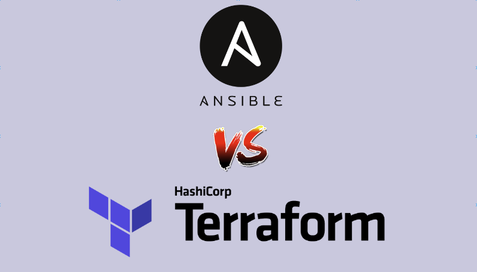
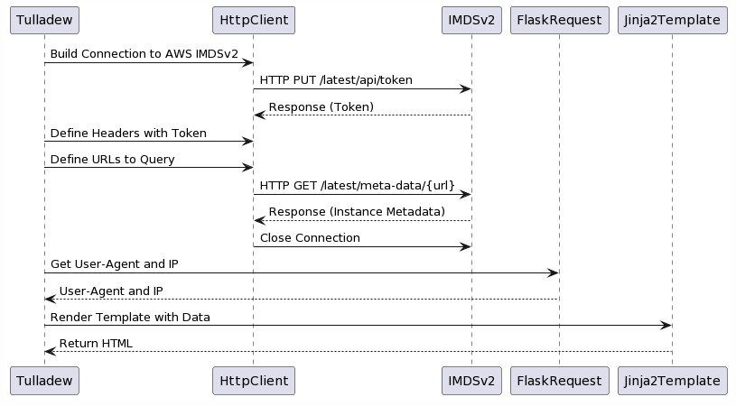
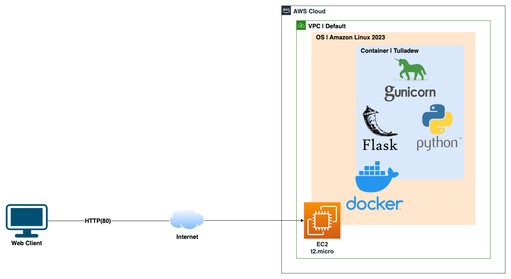

# Ansible vs. Terraform

- [Ansible vs. Terraform](#ansible-vs-terraform)
  - [Overview](#overview)
  - [Tulladew (Flask App)](#tulladew-flask-app)
      - [App Request Sequence Diagram](#app-request-sequence-diagram)
      - [Infrastructure Diagram](#infrastructure-diagram)
  - [Ansible](#ansible)
    - [How to Deploy using Ansible](#how-to-deploy-using-ansible)
  - [Terraform](#terraform)
    - [How to Deploy using Terraform](#how-to-deploy-using-terraform)
  - [Summary](#summary)

## Overview
Ansible and Terraform are both DevOps tools that facilitate efficient management and configuration of IT infrastructure. However, they have distinct differences in terms of design, functionality, and use-cases. Ansible, an open-source automation tool, is known for its robust configuration management and app-deployment capabilities. In contrast, Terraform specializes in provisioning modular infrastructure across various cloud service providers, such as AWS. This project builds a containerized Python Flask app and examines how it can be deployed on AWS using both Ansible and Terraform. The infrastructure built is a development environment with a single EC2 t2.micro instance deployed in the default VPC, accessible via its public IP.



## Tulladew (Flask App)
'Tulladew' is a containerized Flask app. It uses the native Python HTTP client to get instance metadata from EC2 [Instance Metadata Service v2](https://docs.aws.amazon.com/AWSEC2/latest/UserGuide/configuring-instance-metadata-service.html). Additional request information (incoming user-agent and remote IP) is retrieved from the Flask request. Jinja2 template is used to build and return HTML. Gunicorn is used as the Python Web Server Gateway Interface, without a reverse proxy. For production, consider using nginx or a cloud load balancer. The Docker image is built using [Google Distroless Container Tools](https://github.com/GoogleContainerTools/distroless).

#### App Request Sequence Diagram


#### Infrastructure Diagram


## Ansible
Ansible uses the concept of a 'playbook' to define procedural tasks that are run against a set of hosts. Different operating systems, applications, and cloud infrastructure providers have their own modules that define the tasks. The 'Tulladew-infra' playbook, uses the Amazon EC2 module to create a security group that permits SSH and HTTP. If no existing SSH key is found, it creates a new one, then proceeds to launch a t2.micro instance. Once the instance is running, Ansible connects to the remote host via SSH and configures Docker. It then builds the 'Tulladew' image and installs it.

| Pros | Cons |
| --- | --- |
| 1. Ease of use - Ansible uses YAML syntax, easy to read and write. | 1. Procedural style - You need to define the order of execution, which can be complex for large deployments. |
| 2. Agentless - There's no need to install additional software or agents on the managed nodes. | 2. Scalability - While Ansible can be used for large deployments, it may not scale as efficiently as Terraform. |
| 3. Configuration Management - Ansible excels at configuration management tasks. | 3. Infrastructure management - Not as good when compared with Terraform |

### How to Deploy using Ansible
1. Install Ansible
2. Install and configure AWS client with a set of credentials
3. (Optional) Edit security group rules
4. Run the plabook
```
% ansible-playbook tulladew-infra.yml
```

## Terraform
Terraform uses a declarative approach to describe infrastructure using high-level configuration syntax in 'configuration files'. Different entities such as operating systems, applications, and cloud infrastructures have provider-specific resources that dictate how infrastructure is provisioned. For AWS EC2, Terraform requires an existing SSH key pair because the aws_key_pair resource does not support creating new ones. This require manual step to create key pair first. The 'Tulladew-infra' role uses the AWS provider to upload the key, create a security group that permits SSH and HTTP traffic, and then launches a t2.micro instance.

Terraform has a 'remote-exec' provisioner, similar to Ansible, uses SSH to connect to a remote host and execute shell commands. However, it's not recommended for application configuration management, as it's primarily designed for executing simple, one-line commands to bootstrap clusters or other orchestrators. An alternative is to use cloud-init, which is what the 'Tulladew-infra' role uses. It passes the 'user-data.sh' script to the instance using EC2 user_data, a workaround that doesn't scale well with complex apps but works for this simple app and dev environment. The script manages the installation of Docker, building of the 'Tulladew' image, and its deployment. However, this method requires a significant effort and isn't the best approach as it requires embedding app artifacts in the shell script. Additionally, the user_data has a size limitation of 16KB. Any script exceeding this limit would require an external storage solution, like S3, adding more complexity.

| Pros | Cons |
| --- | --- |
| 1. Declarative language - You define what the infrastructure should be and Terraform figures out how to achieve that state. | 1. Learning curve - HashiCorp Configuration Language (HCL) can have a steeper learning curve for those new to it. |
| 2. Provider agnostic - Terraform supports a multitude of providers, so it can manage a diverse range of infrastructures. | 2. No configuration management - Terraform lacks built-in configuration management features and needs to be integrated with other tools or scripting.|
| 3. Immutable Infrastructure - It adheres to the concept of immutable infrastructure. | 3. State file management - The state file must be managed carefully, especially when used in a team. |

### How to Deploy using Terraform
1. Install Terraform
2. Install and configure AWS client with a set of credentials
3. (Optional) Edit security group rules
4. Initialize Terraform
```
% terraform init
```
5. Run apply, review plan and then type 'yes' to deploy
```
% terraform apply
```

## Summary
Ansible, with its simple YAML syntax and robust configuration management capabilities, is good for small projects that require quick setup and consistent state management. However, for larger projects, Terraform shines due to its advanced infrastructure provisioning and provider-agnostic features, ideal for managing diverse, large-scale environments. Combined with other application orchestration tools, Terraform adheres to the principle of immutable infrastructure, preventing configuration drift and reducing inconsistencies, making it a preferable choice for complex, larger-scale projects.